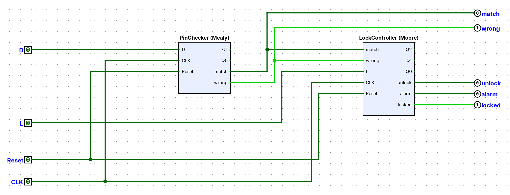

# C3 — Cerradura electrónica con código PIN (FSM Moore + Mealy)

Tarea de Arquitectura de Computadoras: diseño de una máquina de estados finitos
factorizada en dos FSMs interactuando entre sí (una Moore, una Mealy), siguiendo la
metodología de diseño de FSM vista en clase.

José Daniel Cuá Fagiani — Carné 21200

## Circuito principal



Las dos FSMs viven en el mismo archivo y se conectan por cable: `match` y `wrong` salen de
`PinChecker` (Mealy) y entran a `LockController` (Moore). `CLK` y `Reset` son globales.

## Contenido

1. [Diseño general y factorización](docs/01-diseno-general.md)
2. [PinChecker — FSM Mealy](docs/02-pin-checker-mealy.md)
3. [LockController — FSM Moore](docs/03-lock-controller-moore.md)
4. [Verificación (Logisim, vectores de prueba y escenarios)](docs/04-verificacion.md)
5. [Cómo correr las pruebas por línea de comandos](tests/README.md)

## Resultados principales

| FSM | Tipo | Estados | Función |
|---|---|---|---|
| PinChecker | Mealy | 4 (S0–S3) | Compara el PIN dígito por dígito; `match`/`wrong` reaccionan en el mismo ciclo |
| LockController | Moore | 5 (Locked0/1/2, Alarm, Unlocked) | Controla el pestillo y la alarma; salidas dependen solo del estado |

Ecuaciones minimizadas y verificadas con `sympy.logic.boolalg.SOPform` (Quine-McCluskey) —
ver el detalle en cada documento de diseño. Los circuitos se verificaron en Logisim contra
las tablas de transición (todas las combinaciones estado × entrada) y contra los escenarios
de uso completos.

## Estructura del repositorio

```
docs/       explicación del diseño de cada FSM, paso a paso (igual metodología que clase)
tablas/     fsm_tablas.xlsx -- tablas de transición, codificación y salida de ambas FSMs
circuitos/  cerradura_pin.circ -- UN solo archivo de Logisim con tres circuitos:
              - main: diagrama de bloques, PinChecker y LockController conectados por
                cable (match y wrong salen de uno y entran al otro; CLK y Reset son globales)
              - PinChecker: FSM Mealy completa (2 flip-flops D + compuertas AND/OR/NOT)
              - LockController: FSM Moore completa (3 flip-flops D + compuertas AND/OR/NOT)
tests/      vectores de prueba (--test-vector) usados para verificar cada circuito,
            con instrucciones exactas para reproducir la verificación
img/        diagramas de estados y capturas de los circuitos
```

## Cómo abrir y probar

1. Instalar [Logisim Evolution](https://github.com/logisim-evolution/logisim-evolution) v4.1.0 o superior.
2. Abrir `circuitos/cerradura_pin.circ`. Con la herramienta de mano (Poke) se mueven las
   entradas `D`, `L`, `Reset`; un pulso de reloj son dos clics en `CLK` (o `Simulate → Auto-Tick`).
   `Reset` es asíncrono: ponerlo en 1 y luego en 0 deja las FSMs en su estado inicial.
3. Para verificar por consola, ver [tests/README.md](tests/README.md) (todas deben terminar con `Failed: 0`).

## Herramientas usadas

- **Logisim Evolution** (v4.1.0) para los circuitos digitales (fase 2), verificado con su
  modo de consola (`--test-vector`).
- **sympy** (Python) para minimizar las ecuaciones de siguiente-estado y de salida por
  Quine-McCluskey, evitando errores de Karnaugh hecho a mano.
- **openpyxl** (Python) para generar las tablas de FSM en Excel.

## Video

Explicación de la FSM, su funcionalidad y las decisiones de construcción: https://youtu.be/OGVU0EUnTVM
