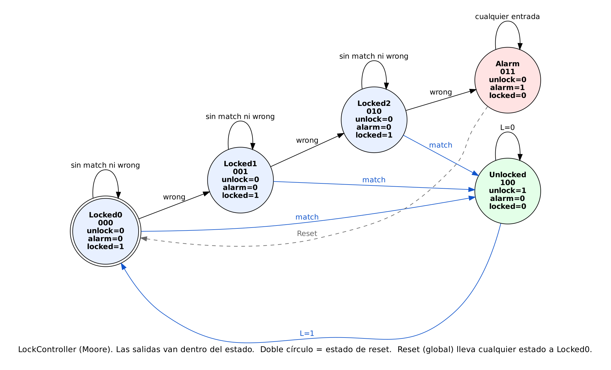
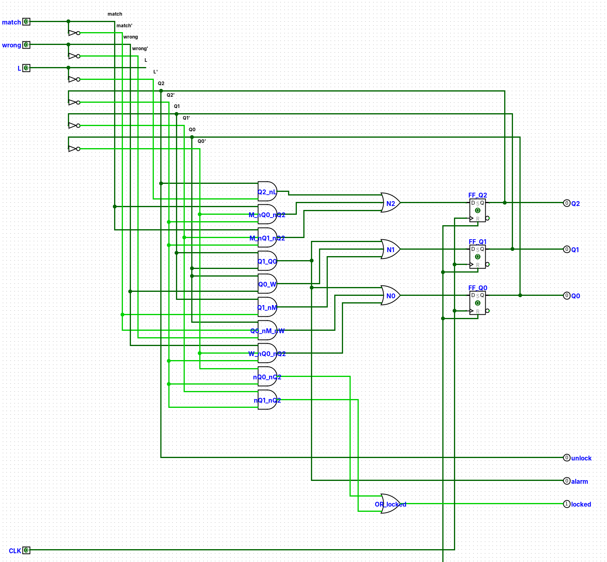

# LockController — FSM Moore

Mismo procedimiento de 7 pasos, aplicado a la máquina que controla el estado físico de
la cerradura.

## 1. Entradas y salidas

- Entradas: `match`, `wrong` (vienen de `PinChecker`), `L` (botón de re-bloqueo, solo
  importa estando abierta).
- Salidas (Moore — dependen solo del estado, se rotulan dentro del círculo):
  `unlock` (abre el pestillo), `alarm` (luz/sirena de alarma), `locked` (LED de
  bloqueada, para tener las tres luces típicas de una cerradura real).
- `match` y `wrong` nunca valen 1 al mismo tiempo (lo garantiza el diseño de
  `PinChecker`) — esto se aprovecha como *don't care* al minimizar.

## 2. Diagrama de transición de estados

5 estados: `Locked0`, `Locked1`, `Locked2` (0, 1 y 2 intentos fallidos), `Alarm`,
`Unlocked`. Doble círculo en `Locked0` (estado de reset).

En texto: desde `Locked0`, `Locked1` o `Locked2`, `match=1` va directo a `Unlocked` (sin
importar cuántos fallos llevaba, un PIN correcto siempre abre); `wrong=1` avanza un
paso en la cadena de fallos (`Locked0→Locked1→Locked2→Alarm`); sin `match` ni `wrong`,
se queda en su propio estado. `Alarm` es un pozo: solo el `Reset` global (la misma señal de reset de todo el circuito) saca de ahí, de vuelta a
`Locked0`. `Unlocked` se queda ahí hasta que `L=1`, y regresa a `Locked0` (no a
`Locked2`: cada intento nuevo empieza limpio).

## 3. Tabla de transición de estados

| S | match | wrong | L | S' |
|---|---|---|---|---|
| Locked0 | 0 | 0 | X | Locked0 |
| Locked0 | 1 | 0 | X | Unlocked |
| Locked0 | 0 | 1 | X | Locked1 |
| Locked1 | 0 | 0 | X | Locked1 |
| Locked1 | 1 | 0 | X | Unlocked |
| Locked1 | 0 | 1 | X | Locked2 |
| Locked2 | 0 | 0 | X | Locked2 |
| Locked2 | 1 | 0 | X | Unlocked |
| Locked2 | 0 | 1 | X | Alarm |
| Alarm | X | X | X | Alarm |
| Unlocked | X | X | 0 | Unlocked |
| Unlocked | X | X | 1 | Locked0 |

(`match=1, wrong=1` a la vez no aparece en la tabla: es físicamente imposible según el
diseño de `PinChecker`, así que se trata como *don't care* al minimizar, igual que las
combinaciones de codificación no usadas.)

## 4. Codificación de estados

5 estados necesitan 3 bits (binario, mismo criterio que en `PinChecker`); quedan 3
combinaciones sin usar, que se tratan como *don't care*:

| State | Encoding (Q2 Q1 Q0) |
|---|---|
| Locked0 | 000 |
| Locked1 | 001 |
| Locked2 | 010 |
| Alarm | 011 |
| Unlocked | 100 |
| *(sin usar)* | 101, 110, 111 |

## 5. Tabla de transición codificada + 6. Tabla de salida

**FSM Encoded State Transition Table:**

| Q2 Q1 Q0 | match | wrong | L | N2 N1 N0 |
|---|---|---|---|---|
| 000 | 0 | 0 | X | 000 |
| 000 | 1 | 0 | X | 100 |
| 000 | 0 | 1 | X | 001 |
| 001 | 0 | 0 | X | 001 |
| 001 | 1 | 0 | X | 100 |
| 001 | 0 | 1 | X | 010 |
| 010 | 0 | 0 | X | 010 |
| 010 | 1 | 0 | X | 100 |
| 010 | 0 | 1 | X | 011 |
| 011 | X | X | X | 011 |
| 100 | X | X | 0 | 100 |
| 100 | X | X | 1 | 000 |
| 101/110/111 | X | X | X | XXX |

**FSM Output Table** (Moore — solo función del estado):

| Q2 Q1 Q0 | unlock | alarm | locked |
|---|---|---|---|
| 000 (Locked0) | 0 | 0 | 1 |
| 001 (Locked1) | 0 | 0 | 1 |
| 010 (Locked2) | 0 | 0 | 1 |
| 011 (Alarm) | 0 | 1 | 0 |
| 100 (Unlocked) | 1 | 0 | 0 |

## 7. Ecuaciones booleanas

Minimizadas con `sympy.logic.boolalg.SOPform`, dándole los *don't cares* de arriba
(estados sin usar + `match·wrong` imposible):

$$N_2 = Q_2\overline{L} + M\overline{Q_0}\,\overline{Q_2} + M\overline{Q_1}\,\overline{Q_2}$$
$$N_1 = Q_1 Q_0 + Q_0 W + Q_1\overline{M}$$
$$N_0 = Q_1 Q_0 + Q_0\overline{M}\,\overline{W} + W\overline{Q_0}\,\overline{Q_2}$$

$$unlock = Q_2 \qquad alarm = Q_1 Q_0 \qquad locked = \overline{Q_0}\,\overline{Q_2} + \overline{Q_1}\,\overline{Q_2}$$

Las salidas quedaron llamativamente simples porque la codificación se acomodó bien:
`unlock` es literalmente el bit `Q2` (es el único estado con ese bit en 1), y `alarm`
es literalmente `Q1 AND Q0` (el único estado con ambos en 1). Esto **no fue
casualidad** — al asignar los códigos en el paso 4, elegí a propósito que `Unlocked`
fuera el único estado con `Q2=1` y `Alarm` el único con `Q1=Q0=1`, sabiendo que esas
salidas iban a depender solo de esos bits. Es un ejemplo concreto de por qué la
codificación de estados (paso 4) no es arbitraria: una buena elección simplifica
directamente la lógica de salida.

## 8. Esquemático

Construido en Logisim en el circuito `LockController` de
[`../circuitos/cerradura_pin.circ`](../circuitos/cerradura_pin.circ) (en las ecuaciones,
`M` = pin `match` y `W` = pin `wrong`):

- **Registro de estado:** 3 flip-flops D (`FF_Q2`, `FF_Q1`, `FF_Q0`), mismo `CLK`; `Reset`
  entra al pin R de cada uno (reset asíncrono a `000` = `Locked0`).
- **Lógica de siguiente estado:** 10 productos AND (el término `Q1·Q0` se comparte entre
  `N1`, `N0` y `alarm`) y un OR de 3 entradas por cada bit: `N2`, `N1`, `N0`.
- **Lógica de salida (Moore, solo depende de `Q2 Q1 Q0`):** `unlock` sale directo del
  riel `Q2`; `alarm` es un AND de `Q1` y `Q0`; `locked` es un OR de dos ANDs
  (`Q0'·Q2'` y `Q1'·Q2'`).
- Mismo estilo de cableado que `PinChecker`: rieles por variable y complemento, y la
  realimentación de cada `Q` vuelve por cable a su riel.
