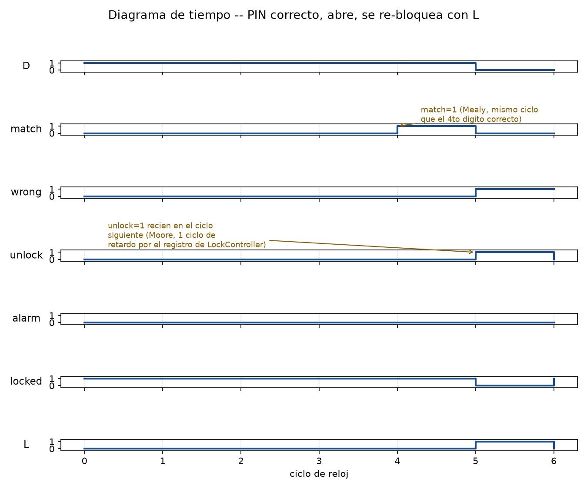

# Verificación

Cada FSM se verificó dos veces, por dos caminos independientes:

1. **Minimización simbólica** (`sympy.logic.boolalg.SOPform`, ver docs 02 y 03) —
   confirma que las ecuaciones booleanas derivadas cubren exactamente la tabla de
   transición diseñada, sin errores de Karnaugh a mano.
2. **Circuito real en Logisim Evolution**, verificado por línea de comandos
   (`--test-vector`, ver [`../tests/README.md`](../tests/README.md)). Los vectores se
   generaron a partir de las TABLAS de transición (no de las ecuaciones) y recorren los
   4 estados × 2 entradas de `PinChecker` y los 5 estados × todas las entradas de
   `LockController`, más los escenarios completos de abajo sobre `main`. Confirma que el
   circuito construido con compuertas implementa la tabla sin errores de cableado.
   Ver [`../circuitos/`](../circuitos/).
3. **Simulación independiente en Python** (ciclo a ciclo, sincrónica), reimplementando
   las mismas ecuaciones desde cero para tener una tercera fuente de verdad, y usada
   para generar escenarios completos de uso real (no solo tablas de verdad aisladas).

## Escenarios simulados

**1. PIN correcto al primer intento** — 4 dígitos correctos seguidos:

```
ciclo  D | PinChecker LockController | match wrong unlock alarm locked
    1  1 |         S0        Locked0 |     0     0      0     0      1
    2  1 |         S1        Locked0 |     0     0      0     0      1
    3  1 |         S2        Locked0 |     0     0      0     0      1
    4  1 |         S3        Locked0 |     1     0      0     0      1
```
`match` se activa en el ciclo 4, apenas entra el 4to dígito correcto.

**2. Dos intentos fallidos y luego uno correcto** — confirma que `PinChecker` se
reinicia a `S0` en cada fallo y que `LockController` avanza `Locked0 → Locked1 → Locked2`
sin llegar a `Alarm`, y que un PIN correcto abre incluso después de fallos previos.

**3. Tres fallos seguidos → Alarm** — la parte más importante del diseño de seguridad:

```
ciclo  D | PinChecker LockController | match wrong unlock alarm locked
    1  0 |         S0        Locked0 |     0     1      0     0      1
    2  0 |         S0        Locked1 |     0     1      0     0      1
    3  0 |         S0        Locked2 |     0     1      0     0      1
    4  1 |         S0          Alarm |     0     0      0     1      0
    5  1 |         S1          Alarm |     0     0      0     1      0
    6  1 |         S2          Alarm |     0     0      0     1      0
    7  1 |         S3          Alarm |     1     0      0     1      0
```
Notar que en el ciclo 7 `match=1` (el PIN correcto se volvió a ingresar completo),
pero `LockController` se queda en `Alarm` de todas formas — **por diseño**: desde
`Alarm` solo el `Reset` global saca de ahí, `match` y `wrong` se ignoran. Un PIN
correcto ya no basta para desbloquear una cerradura en alarma.

**4. Abre y se re-bloquea con `L`** — este es el escenario más interesante para el
timing Moore vs. Mealy, con diagrama de onda:



`match` se activa en el ciclo 4 (mismo ciclo que el 4to dígito, típico de una salida
Mealy). Pero `unlock` no se activa hasta el ciclo 5 — un ciclo de retardo — porque
`unlock` es la salida Moore de `LockController`, y por definición **solo depende del
estado ya estable**: `LockController` tiene que recibir el pulso `match` en un flanco
de reloj y actualizar su propio registro de estado antes de que `unlock` pueda
reflejarlo. Este es exactamente el mismo efecto que muestra el "Moore & Mealy Timing
Diagram" de las slides de clase, pero surge acá de manera natural por tener dos FSMs
encadenadas en vez de una sola.
